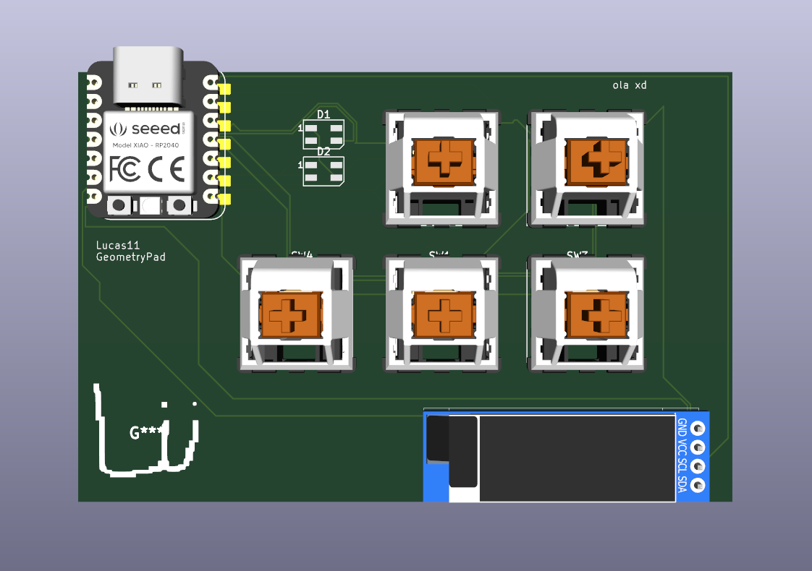

# Journal
## First day (aka: 16/05/2025 hour: 14:51)
Going to start Highway with Hackpad!
I got the project started and im going to orginized all of this.
## Hour: 14:58
Finished ordering all the stuff and ready to start!
Also im wating to load all the symbols.
## Hour: 15:43
Finished installing all of the symbols.
## Hour: 15:58
FINALY IS WORKING OH MY GOD I HATE SYMBOLS
ok time to make acutaly the pcb
## Hour: 17:53
Finished PCB.
Now time to do the case!
## Hour: 20:04
Finished the PCB.
## Hour: 22:08
Tommorrow im going to start doing the base and then fix all the errors in the pcb
# Day 1 Finished.
# Day 2
Starting to do the base!
# Hour 12:02
Finished Sketching.
# Hour 13:06
Taking a brake, also fixed alot of errors of the pcb, therse only five now! (before it was 11)
# Hour 17:44
Forgot to put images :(
Heres the pcb and the model right now.

# Hour 18:56
I asked Lukas for help bcs i suck at modeling.
heres the photo of the base cad.

